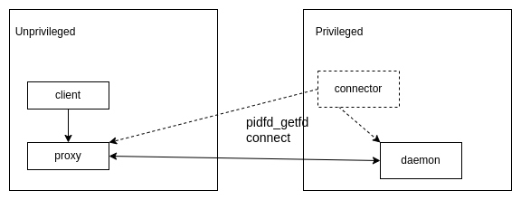

# Use pidfd_getfd in container

This repository contains an example how to use the syscall [pidfd_getfd](https://man7.org/linux/man-pages/man2/pidfd_getfd.2.html) (available from kernel 5.6) to connect qemu running in an unprivileged pod to the pr-helper running in a privileged container.

The picture shows in more details the flow how the connection is performed:


## Build
Compile and build the image `getfd`:
```bash
make images
```
## Example
Run the containers and connect the proxy to the pr-helper:
```bash
./run-containers
```
Test qemu:
```
docker exec -ti qemu /start-qemu.sh
```
