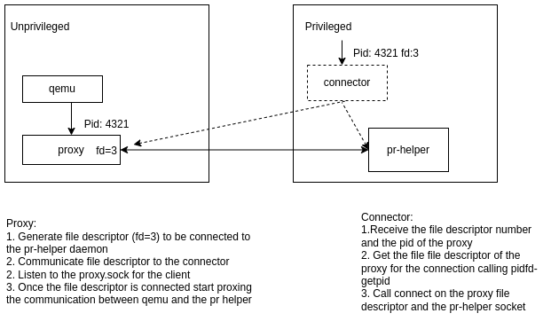

# Use pidfd_getfd in container

This repository contains an example how to use the syscall [pidfd_getfd](https://man7.org/linux/man-pages/man2/pidfd_getfd.2.html) (available from kernel 5.6) to connect qemu running in an unprivileged pod to the pr-helper running in a privileged container.

This repository contains 2 programs:
  * the *proxy* responsible to forward the data between qemu and the pr-helper
  * the *connector* responsible to connect the proxy to the pr-helper

The picture shows in more details the flow how the connection is performed:


This repositories contains the containerized setup to test and verify the persitent reservation with qemu and the pr-helper. The script assumes to use a SCSI disk `/dev/sdb` (see this [gist](https://gist.github.com/alicefr/c2e4221d7c8834a2b8746d510692d86c) to create a loop SCSI device)

## Build
Compile and build the image `getfd`:
```bash
make images
```
## Example
The script `run-containers` initially launches the proxy in the `qemu` container and the pr-helper in the `pr-helper` container. Then it uses the connector available in the `pr-helper` container to connect the proxy to the pr-helper. Finally, it boot a VM using QEMU configured to use the proxy and the persistent reservation. The disk image available in the `qemu` container already has the `sg3_utils` installed to perform the scsi persistent reservation as described in the [gist](https://gist.github.com/alicefr/c2e4221d7c8834a2b8746d510692d86c)
Run the containers and connect the proxy to the pr-helper:
```bash
./run-containers
```
